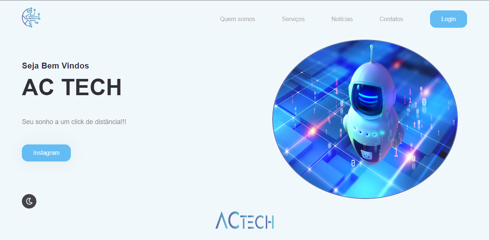

<h1 align="center">
  
    ACtech
</h1>

<h4 align="center">
    Uma plataforma que conecta as melhores soluções de TI.
</h4>

<h4 align="center"><a href="#">Clique para visitar o projeto</a></h4>

## 📚 Seções
O site é composto por 6 seções diferentes:

- **Home:** Nele temos uma breve apresentação;
- **Quem somos:** Nessa seção tenho uma descrição dizendo um pouco sobre quem somos;
- **Serviços:** Exibe através de cards os diferentes serviços em que possuímos conhecimentos;
- **Notícias:** As melhores notícias de tecnologia você encontra aqui;
- **Contatos:** Nele irá apresentar formas de contactar a empresa;
- **Login:** Loga com sua conta e venha ficar por dentro de tudo;

---

## 💼 Tecnologias utilizadas
Para o desenvolvimento deste site utilizei as seguintes tecnologias:

- HTML;
- CSS;
- JavaScript;
---

##  Autor 
<table>
  <tr>
    <td align="center">
      <a href="https://github.com/avittoriaag">
         
        
          <b>Vitória Alves</b>
        
      </a>
    </td>
  </tr>
  
</table>